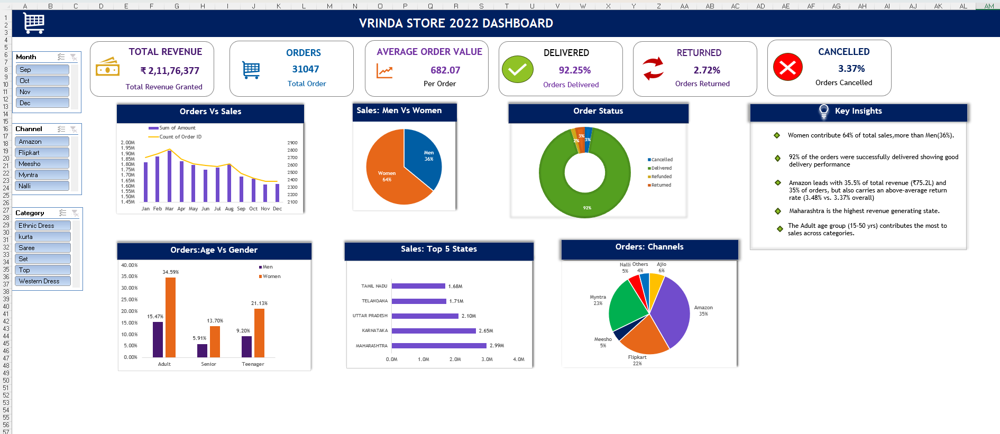

# Vrinda Store Sales Dashboard

An interactive Excel dashboard analyzing 31,000+ orders for Vrinda Store, built to track sales performance and surface actionable business insights across channels, demographics, and geography.

 
 
## Overview

This project takes raw order-level data and turns it into a KPI-driven dashboard that lets stakeholders filter and explore performance by month, sales channel, and product category — without touching a single formula.

## Tools Used

- Microsoft Excel
- Pivot Tables & Pivot Charts
- Slicers (Month, Channel, Category)
- Excel Formulas (including `GETPIVOTDATA`)
- Power Query

## Dashboard Features

- **KPI cards** — Total Revenue, Orders, Average Order Value, Delivered %, Returned %, Cancelled %
- **Orders vs Sales trend** — monthly revenue and order volume
- **Sales: Men vs Women** — gender-wise revenue split
- **Order Status breakdown** — delivered, returned, refunded, cancelled
- **Orders: Age vs Gender** — demographic breakdown of order volume
- **Sales: Top 5 States** — highest revenue-generating states
- **Orders: Channels** — order distribution across sales channels (Amazon, Flipkart, Myntra, Meesho, Ajio, Nalli, Others)
- **Key Insights panel** — plain-language summary of the findings below

## Key Insight

**Amazon is the top-performing channel — and a fulfillment risk.**

Amazon drives **35.5% of total revenue (₹75.2L of ₹2.11Cr)** and **35% of order volume (11,016 of 31,047 orders)**, making it the single largest channel by a wide margin. However, it also carries a **return rate of 3.48%**, above the overall average of **3.37%** across all channels.

Given its scale, even a small percentage-point improvement in Amazon's return rate would meaningfully reduce total returns — making it a natural first place to investigate fulfillment or product-fit issues.

Supporting findings:
- Women contribute 64% of total sales, more than men (36%)
- 92% of orders were successfully delivered, indicating strong overall delivery performance
- Maharashtra is the highest revenue-generating state
- The adult age group (15–50 yrs) contributes the most to sales across categories

## How the Insight Was Derived

The return-rate and revenue-by-channel figures were calculated using `GETPIVOTDATA` formulas against pivot tables built on the full order dataset, then cross-checked against channel-level totals. This analysis lives on two supporting sheets in the workbook — hidden behind the main dashboard tab for a clean first view, but available via **Right-click any tab → Unhide** for anyone who wants to see the underlying formulas.

## File

- `Vrinda_Store_Data_Analysis_Dashboard.xlsx` — full interactive workbook (dashboard + hidden analysis sheets)
